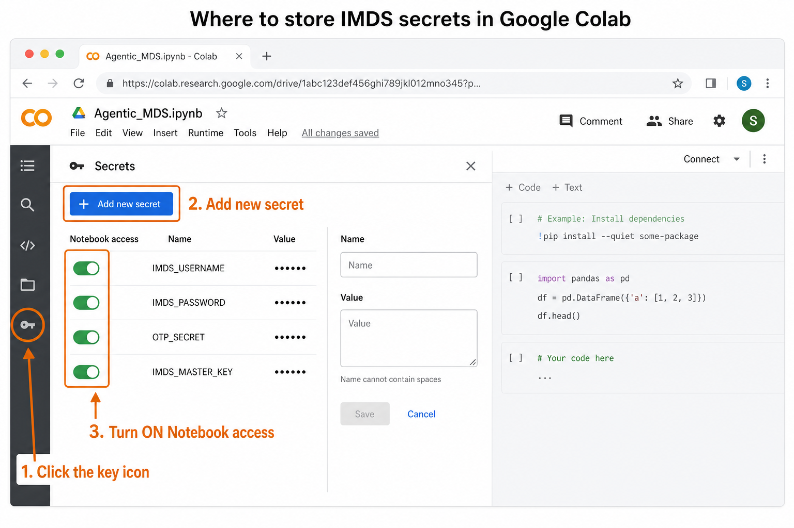

# Agentic MDS

Internal executive briefing on an internally built agentic workflow for IMDS MDS review and approval.

## Presentation

- **UI demo video (45s):** [presentations/IMDS_Agentic_Workflow_Demo.mp4](presentations/IMDS_Agentic_Workflow_Demo.mp4)
- **Live briefing (GitHub Pages):** https://rockyforever8-sys.github.io/Agentic-MDS/
- **CDN fallback:** https://cdn.jsdelivr.net/gh/rockyforever8-sys/Agentic-MDS@cursor/imds-powerpoint-presentation-07ca/docs/index.html
- **PowerPoint:** [presentations/IMDS_Agentic_Workflow.pptx](presentations/IMDS_Agentic_Workflow.pptx) or [docs/IMDS_Agentic_Workflow.pptx](docs/IMDS_Agentic_Workflow.pptx)
- **PDF:** [docs/IMDS_Agentic_Workflow.pdf](docs/IMDS_Agentic_Workflow.pdf)

Open the `.pptx` in Microsoft PowerPoint (widescreen 16:9) for the meeting. Use the Pages site for browser review. The repo is public; treat the **Internal Confidential** marking as a handling instruction, not access control.

12 slides, ~20 minutes (+ 1 appendix for Q&A), marked **Internal Confidential**. Presented by the Supplier Quality Director to VP/GM of Operations, Supply Chain, Quality, and HR.

Covers:

1. Introduction of IMDS (production gate, Rec 001, PPAP)
2. Supplier roles in tier MDS submission (six inbox actions; GM / VW / Ford overlays)
3. Daily time and the ~5,000 open MDS backlog
4. Agentic auto-accept / auto-reject model we will build
5. Market options as proof — recommendation is to **build**, at zero software spend

Speaker notes are timed on every slide.

## IMDS Colab agent

- **Logic:** [`imds_decisions.py`](imds_decisions.py) (green / amber / red, no Playwright)
- **Private secrets:** [`imds_secrets.py`](imds_secrets.py) (Colab 🔑 + encrypted vault, never committed)
- **Playwright agent:** [`imds_agent_v2.py`](imds_agent_v2.py)
- **Start in Colab (recommended):** [Open Colab_Start_Here.ipynb](https://colab.research.google.com/github/rockyforever8-sys/Agentic-MDS/blob/main/Colab_Start_Here.ipynb)
- **Full notebook:** [`Agentic_MDS.ipynb`](Agentic_MDS.ipynb) — use **File → Upload notebook**. Do **not** paste the `.ipynb` JSON into a code cell (`NameError: true` means that happened).

Put `IMDS_USERNAME`, `IMDS_PASSWORD`, `OTP_SECRET`, and `IMDS_MASTER_KEY` in Colab Secrets. They are private to your Google account. The notebook encrypts a vault to Drive `MyDrive/imds_private/credentials.enc` (gitignored).

Colab already has an asyncio event loop, so Playwright’s **sync** API cannot start in the notebook process (`Please use the Async API instead`). The green button and `orchestrate()` launch `python -u imds_agent_v2.py` in a **subprocess**.

Colab also does not ship Chromium OS libraries. Cell 1 runs `python -m playwright install-deps chromium` (not only `install chromium`). Without that, launch fails with `libatk-1.0.so.0: cannot open shared object file`. Re-run Cell 1 if this runtime cloned or installed before that fix.

Where to click (key icon in the left sidebar):



```bash
python -m unittest discover -s tests -v
python imds_agent_v2.py --self-test   # no IMDS login
# python imds_agent_v2.py             # live run
```

Live default: **10 MDS**. PASS → accept + forward + propose. FAIL **and amber** → reject. Report: `imds_output/mds_status_report.csv` keyed by MDS ID. Kill switch: `IMDS_KILL_SWITCH=1` or `imds_output/KILL`.

## Rebuild

```bash
pip install -r requirements.txt
python scripts/build_imds_presentation.py
python scripts/build_demo_video.py   # needs ffmpeg; screenshots in docs/demo-steps/
```
